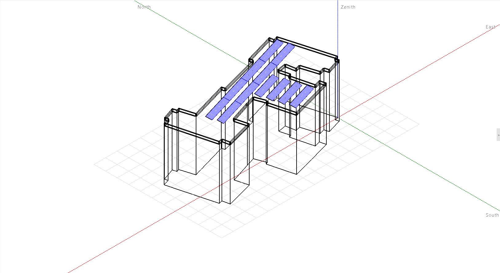
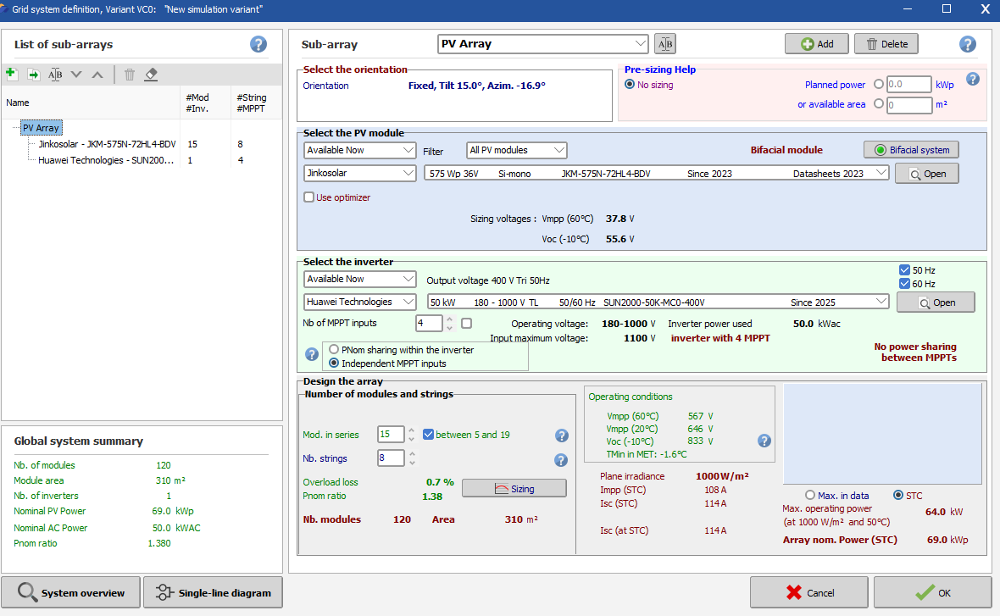

# Bahcesehir University U Block rooftop PV / WORK IN PROGRESS

Indicative near-shading and energy model for a campus rooftop in Besiktas, Istanbul.

Status: WIP. Geometry and yield are a first pass. Techno-economic numbers will be rebuilt when missing site data are available.

## What is done

Google Earth footprint to AutoCAD 3D body to PVsyst near-shading scene to grid-connected yield.

KML outline -> AutoCAD (.dwg) -> Collada (.dae) -> PVsyst Near Shadings

1. Building outline traced in Google Earth and exported as KML.
2. Outline converted to local metres (UTM 35N, +Y = north, Z up) and extruded in AutoCAD with a SCRIPT file.
3. Same solid exported as Collada .dae and imported into PVsyst Near Shadings.
4. Tables placed on the roof (tilt 15 degrees, azimuth about -17 degrees, slightly east of south).
5. System simulated with Meteonorm 9.0 for Besiktas.

## PV system (current variant)

| Item | Value |
|---|---|
| Site | Besiktas, Istanbul (campus U Block roof) |
| Modules | 120 x JinkoSolar JKM-575N-72HL4-BDV (n-type, bifacial, 575 Wp) |
| Array | 69.0 kWp DC |
| Inverter | 1 x Huawei SUN2000-50K-MCO-400V (50 kWac, 4 MPPT) |
| Strings | 8 strings x 15 modules (Pnom ratio 1.38) |
| Orientation | Fixed, tilt 15 degrees, azimuth -16.9 degrees |
| Horizon | Building and parapet in the 3D scene |
| Indicative yield | about 99 MWh/year, about 1430 kWh/kWp (TMY; will move when geometry or load change) |

Bifacial albedo and module/table layout are still open to revision.

## What is missing

These inputs were not available when the model was built. They will be replaced before a techno-economic chapter is issued:

- Surveyed building height
- Surveyed parapet height and thickness
- Roof build-up, walkways, HVAC / lift overruns, safety setbacks
- Campus hourly or monthly electricity consumption for U Block
- Applicable commercial tariff for the meter
- Contractor EPC quote
- Structural capacity of the slab and preferred mounting

Until those exist, won't share any LCOE / payback / NPV in PVsyst since they are conjectural only.

## Disclaimer

Heights, costs and tariffs are order-of-magnitude. Geometry comes from a public KML trace. This is not an official campus drawing and not investment advice.
